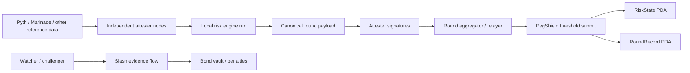

# Multi-Attester Design

Risk oracle, not price oracle. For Solana LSTs as collateral.

This document describes PegShield's threshold-attested oracle path: bonded attester registry, pending-update confirmations, disputes, and slashable operator bonds. The code now includes the core on-chain accounts and instructions; the remaining work is production operation with independent attesters.

## Why This Exists

PegShield started as a single-authority updater:

- one off-chain bridge fetches prices and reference rates
- one engine computes the risk payload
- one authority signs `update_risk_state`
- one on-chain PDA stores the latest suggested LTV and diagnostics

That compatibility path remains for devnet and migration. The protocol path now adds an `AttesterRegistry`, bonded attesters, `PendingUpdate` rounds, threshold `confirm_update`, and dispute/slash flow. The next production step is not more math; it is running this path with independent operators and disciplined key custody.

## Design Goals

- Preserve the current consumer surface: protocols still read a single `RiskState` PDA.
- Replace single-signer trust with threshold attestation: `m` valid operator approvals out of `n`.
- Keep the hot write path simple enough to operate reliably during volatile markets.
- Make equivocation and obviously invalid submissions economically punishable.
- Avoid putting heavy statistical computation on-chain.

## Non-Goals

- No full off-chain consensus network.
- No on-chain recomputation of OU / ADF / calibration.
- No instant cryptoeconomic perfection in v1 of the threshold scheme.
- No requirement that every attester submit the same transaction directly on-chain.

## Current vs Target

| Property | Current | Target |
|---|---|---|
| Writers | 1 authority key in compatibility mode | `m-of-n` bonded attester approvals |
| On-chain acceptance | `has_one = authority` | threshold-confirmed pending update |
| Accountability | social / operational only | slashable bond + dispute record |
| Liveness | one keypair must be online | any sufficiently large subset can progress |
| Consumer read path | single PDA | unchanged single PDA |

## Operator Readiness Check

Use the CLI before asking any integrator to trust a multi-attester feed:

```bash
npm --prefix cli run start -- multi-status mSOL-v2
npm --prefix cli run start -- multi-status mSOL-v2 --round 42
```

The command returns:

- `ready`: true only when the oracle is in multi-attester mode, the state is fresh, the registry exists, threshold is at least 2, and enough active attesters meet the minimum bond.
- `blockers`: conditions that must be fixed before production use, such as stale oracle state, single-attester mode, missing registry, insufficient attesters, insufficient bond, or an expired unfinalized round.
- `warnings`: conditions that deserve operator attention but do not automatically block reads, such as a current critical regime, a live unfinalized pending round, or active attesters with lost disputes.

This is intentionally an operator gate, not a new on-chain account. Consumers still read the same `RiskState` PDA; operators use `multi-status` to prove that the trust model behind that PDA is actually the intended threshold-attester path.

## High-Level Architecture



## Core Idea

Each attester independently computes the same canonical payload for a given round:

- `lst_id`
- round id
- source timestamps / slot anchors
- `theta_scaled`
- `sigma_scaled`
- `regime_flag`
- `suggested_ltv_bps`
- `z_score_scaled`
- payload expiry

They sign the hash of that payload off-chain. A relayer gathers at least `m` signatures and submits a single on-chain transaction that:

1. verifies the attesters are active members of the configured committee
2. verifies at least `m` unique signatures over the same payload hash
3. verifies the round is newer than the last accepted round
4. verifies the payload is still within its validity window
5. updates the canonical `RiskState`
6. stores a compact round record for audit and later challenge

Consumers still read one PDA. The trust model changes without forcing integrators to change their read path.

## Accounts and State

The current `RiskState` account stays, but ownership of updates moves from a single authority to a committee configuration.

### `CommitteeConfig`

Global or per-asset configuration account:

- `committee_id`
- `lst_id_scope` or global scope
- `threshold_m`
- `member_count_n`
- `epoch`
- `valid_from_slot`
- `max_round_staleness_secs`
- `slash_receiver`
- `committee_admin`

### `AttesterRegistry`

One account per operator:

- `attester_pubkey`
- `bond_vault`
- `bond_amount`
- `status` (`ACTIVE`, `PAUSED`, `EXITING`, `SLASHED`)
- `metadata_uri`
- `joined_epoch`

### `RoundRecord`

Stored per accepted round:

- `lst_id`
- `round_id`
- `payload_hash`
- `accepted_at_slot`
- `accepted_at_timestamp`
- `signer_bitmap` or signer pubkey list
- `submitter`

### `RiskState`

Still the primary consumer account, but the authority field becomes either:

- a program-owned committee authority, or
- a deprecated field retained for backwards compatibility while the update path changes

## Round Lifecycle

### 1. Deterministic input window

All attesters must compute from the same canonical input window. This avoids one node signing "slightly newer" data while another signs older data.

A round should be keyed by:

- asset id
- source timestamp bucket
- source publish time or slot anchor
- committee epoch

Example:

```text
round_id = sha256(lst_id || source_publish_time || committee_epoch)
```

### 2. Independent computation

Each attester:

- fetches the same market data class
- normalizes the same reference rate
- computes the same risk payload
- serializes the canonical byte layout
- signs `payload_hash`

### 3. Aggregation

A relayer or any committee member collects signatures until threshold is reached.

The relayer is not trusted for correctness. It only packages already-signed evidence.

### 4. On-chain acceptance

The program accepts the update only if:

- `round_id` is new
- signatures are unique
- all signers are active registry members
- signature count is at least `m`
- payload parameters satisfy the same numeric checks PegShield already uses
- the round is not stale

### 5. Challenge window

After acceptance, watchers can submit evidence that:

- an attester signed conflicting payloads for the same round
- a signer was not active in the committee at that epoch
- the payload used invalid or expired round metadata

This is where slashing attaches real cost to bad behavior.

## Signature Format

The signed message should be fully domain-separated and chain-specific:

```text
PEGSHIELD_ATTEST_V1 ||
cluster ||
program_id ||
committee_epoch ||
lst_id ||
round_id ||
payload_hash ||
expires_at
```

This avoids replay across:

- clusters
- different deployed programs
- committee epochs
- assets

## Aggregation Strategy

There are two realistic options:

### Option A: Verify `m` Ed25519 signatures on-chain

Pros:

- simple to reason about
- no new cryptography assumptions
- easiest to ship first

Cons:

- larger transactions
- more compute consumed per update

This is the pragmatic first version.

### Option B: Aggregate signatures off-chain, verify one proof on-chain

Pros:

- lower on-chain verification cost at scale

Cons:

- much more implementation risk
- more cryptographic complexity than PegShield needs right now

This should be treated as a later optimization, not the first threshold release.

## Slashing Model

The goal of slashing is not to punish every bad estimate. It is to punish clearly provable misconduct.

Slashable offenses should be narrow and objective:

1. Equivocation
   An attester signs two different payload hashes for the same `round_id`.
2. Unauthorized signing
   A signer signs while not active in the committee epoch.
3. Invalid round metadata
   A signer signs a payload with expired validity or wrong committee epoch.

Not slashable by default:

- ordinary model disagreement when input sources are ambiguous
- temporary downtime
- a conservative but non-malicious payload within allowed bounds

### Bond Handling

Each attester posts a bond into a program-controlled vault.

When slashing succeeds:

- part of the bond is burned or transferred to a protocol treasury
- part can be paid to the challenger as a bounty
- the operator can be auto-paused or fully ejected depending on severity

## Committee Rotation

Committee membership must rotate without breaking consumers.

Recommended approach:

- committee changes happen at explicit epochs
- each round references one committee epoch
- old epochs remain challengeable for a fixed window
- new rounds only accept signatures from the current epoch

This avoids ambiguous membership during transitions.

## Failure Modes and Behavior

### Less than threshold online

Result:

- no fresh update lands
- `RiskState` becomes stale
- consumers fall back to conservative policy through existing staleness guards

This is acceptable. Safety beats liveness.

### One attester compromised

Result:

- attacker still cannot update alone
- attacker can only cause harm if they control at least `m` keys or convince honest nodes to sign bad payloads

### Relayer compromised

Result:

- relayer can censor or delay
- relayer cannot forge threshold signatures
- any other party can step in as relayer if they hold the signed payload set

### Data-source disagreement

Result:

- attesters fail to converge on the same payload hash
- no threshold update lands
- oracle goes stale rather than publishing inconsistent state

This is the intended safety behavior.

## Migration Plan

### Phase 0: Today

- single authority
- single updater
- current `RiskState` schema

### Phase 1: Registry and committee config

- deploy registry accounts and committee config
- keep the existing single-authority update path active
- operationally test committee membership and bond handling

### Phase 2: Threshold submit path

- add new instruction: `submit_threshold_update`
- keep old instruction disabled for production use but available on devnet if needed
- update artifact metadata and SDK output to expose committee mode

### Phase 3: Challenge and slashing

- add round records
- add equivocation proof path
- connect bond vault penalties

### Phase 4: Decommission single-authority mode

- freeze or remove direct `authority` update path
- accept only threshold-attested rounds

## What Changes for Consumers

Very little, by design.

Consumers should still:

- read one `RiskState` PDA
- check freshness
- check `regime_flag`
- clamp protocol-side LTVs

Optional extra metadata may be exposed:

- committee epoch
- signer count
- attestation mode (`single` vs `threshold`)
- latest round id

But the core integration path stays the same.

## Open Questions

- Should committee membership be global or per-asset?
- Should liveness require homogeneous infrastructure, or should operators be forced onto different cloud / RPC providers?
- How large should the challenge window be before bonds unlock?
- Should PegShield require one signer to be a neutral watcher rather than a core operator?
- Do we want a second data-source quorum before attesters are even allowed to sign?

## Recommended First Version

If this were being built next, the right order is:

1. per-asset `CommitteeConfig`
2. `AttesterRegistry` with slashable bonds
3. `submit_threshold_update` verifying `m` Ed25519 signatures on-chain
4. `RoundRecord` storage
5. equivocation slashing only

That gets PegShield off the single-key trust model without overbuilding the first threshold release.
